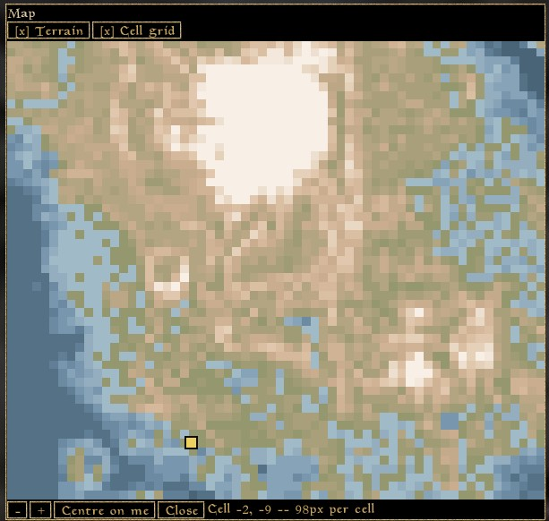
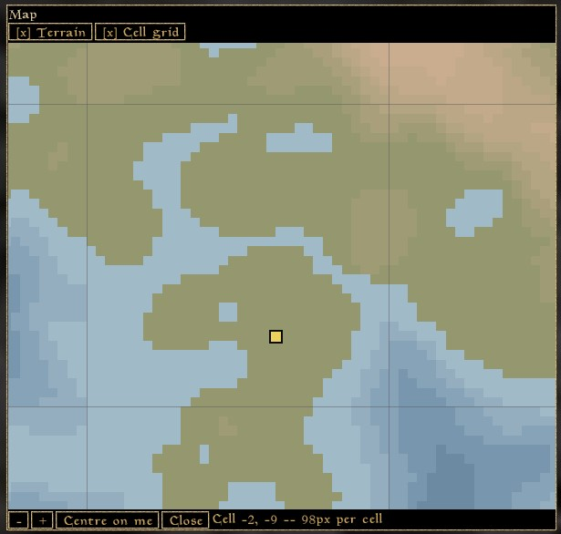

# Pixel Map — a world map drawn in Lua (OpenMW)

A pixel-style map drawn from the terrain itself, so
it works with whatever landmasses your load order adds.

It is not the vanilla map. There is no fog of war; the engine does not
tell Lua which cells you have explored, so the coastline is there whether
you have walked it or not.

## Setup

Point `openmw.cfg` at the mod directory and enable its script list:

```
data="<path to>/openmw-lua/PixelMap"
content=PixelMap.omwscripts
```

Bind a key under **Options → Scripts → Pixel Map**.

## Controls

| | |
| --- | --- |
| Drag the map | Pan |
| Click the map | Centre there |
| Mouse wheel | Zoom |
| `+` / `−` | Zoom |
| Centre on me | Jump back to your own position |
| `[x] Name` | Show or hide a layer |
| Drag the top of the window | Move the window |
| Drag an edge or corner | Resize the window |

The window opens at about three quarters of your screen.

## Screenshots



## Settings

**Colour theme** — *Muted*, the default, is a soft physical-atlas
palette. *Classic MW* is the dark, parchment-brown look of the vanilla
world map. *Vivid* is a bright, high-contrast atlas palette.

**Terrain colouring** — *Relief* shades the map by height, like a
physical map: deep sea through shallows, then low ground, hills, peaks.
*Flat* uses one colour for land and one for sea, which is clearer under
another mod's overlay and quicker to draw. Both are drawn from whichever
theme is selected.

## Layers

Two ship with the mod, each with a toggle above the map:

- **Terrain** — the map itself.
- **Cell grid** — cell boundaries, once you are zoomed in far enough for
  them to be readable.

Your own position is always marked and has no toggle.

Other mods can add layers of their own; see [API.md](API.md).

## Known limits

- Exteriors only. In an interior the map has nothing to show.
- A drag that starts on top of a marker does not pan the map.
- Layer toggles and window size are not remembered between sessions.
- Panning redraws the map, so it follows the cursor in steps rather than
  smoothly. If it stutters on a large landmass, raise
  `DRAG_REDRAW_PIXELS` in `scripts/PixelMap/core/config.lua`.
